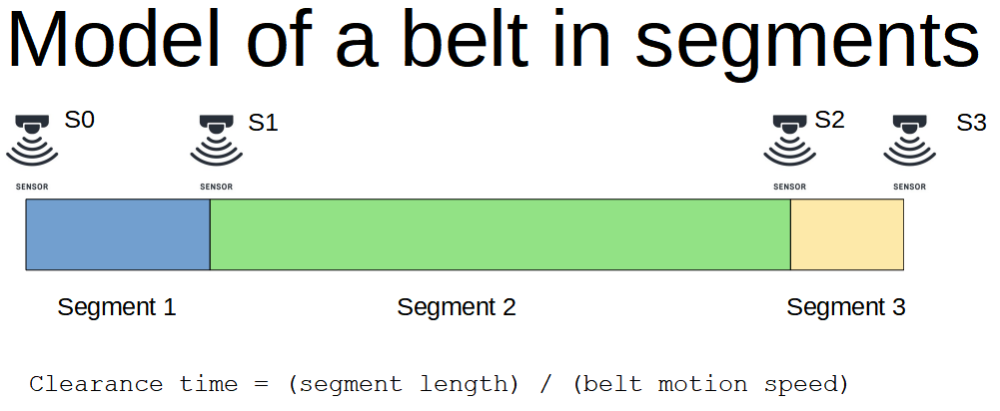

# Belt monitor system with alarm generation
The Belt monitor system is a Java microservice (Spring Boot app) that monitors a conveyor belt controlled by beam sensors.
Every time a sensor detects an item on the belt, it sends an event to the system that is processed by an EventEngine.
Alarms are generated when:
- the number of items in transit on the belt is greater than the maximum allowed (10)
- an item is stuck between 2 consecutive sensors

# Definitions

- A belt is modelled as a series of adjacent segments each of them with a sensor in entrance and exit where items are carried at a constant motion speed
- A segment is a portion of the belt characterised by a length, a pair of controlling sensors and a counter for the number of events related to each sensor since monitoring starts
- A sensor is a device able to detect when an item transits on the belt and to send a measurement as an event
- An event from a sensor contains the originating sensor identifier and the timestamp (epoch)
- The clearance time for a segment is the time an item entering the segment will take to clear the segment length and is equal to its length divided by the belt motion speed
- An alarm is an anomalous condition detected on the belt when events are processed

# Assumptions
- The motion speed of the belt never changes and keeps one direction only
- The belt never stops
- Items are always introduced on the belt from the first segment of the belt
- Items are moving separately with no overlapping
- The number of items on a segment at any given time is the difference between the number of events at the exit sensor minus the number of events at the entry sensor for the segment
- The number of items transiting on the belt is the sum of the items on each segment of the belt
- An item is considered stuck on a segment if it does not clear the segment length within the expected clearance time

# Architecture
The Belt monitoring system is a Spring Boot application that includes an EventCollector exposing a REST API to which sensors can submit events.
The EventCollector has a PersistenceService that allows events to be stored in memory and an EventService that processes events generating alarms accordings to some rules. Alarm details are just logged at the moment.

# Documentation
More documentation is available in the docs folder
- belt.png
- belt.postman_collection.json
- README.pdf

# How to build the project
```sh
./gradlew clean build
```

# How to run the application
```sh
./gradlew bootrun
```
